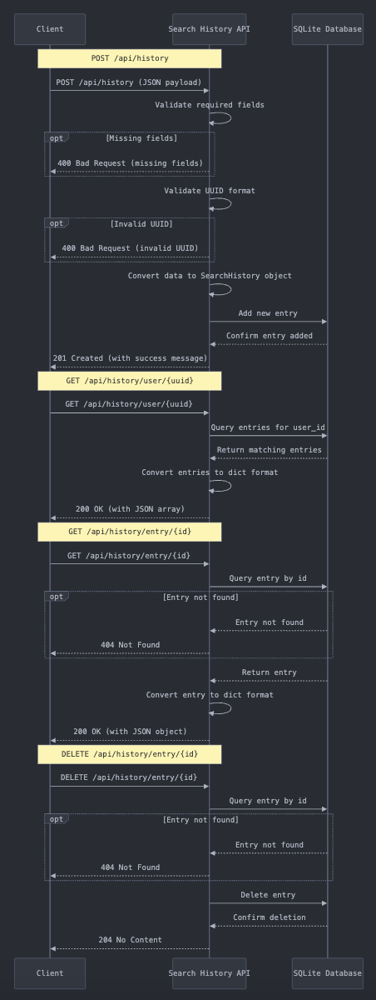

# User Search History Service

## `POST /api/history`
### Requests
- Request must contain:
  - `userId`: The user's ID
  - `query`: The search query
  - `parameters`: The parameters for the search
  - `timestamp`: The timestamp of the search
  - `tags`: The tags for the search
  - `notes`: The notes for the search
  - `responseData`: The response data from the search
  - `results`: The results from the search, nested within `responseData`

### Response
- Returns a 201 code and a JSON object with the following fields on success:
  - `id`: The ID of the history entry
  - `status`: The status of the request
  - `message`: The message from the request
  - `timestamp`: The timestamp of the request
- Returns a 400 error if the request is missing any required fields
- Returns a 500 error if the service failed to save the history entry

### Usage
```python
import requests

url = "http://localhost:5000/api/history"

data = {
    "userId": "123e4567-e89b-12d3-a456-426614174000",
    "query": "test query",
    "parameters": {"param1": "value1", "param2": "value2"},
    "timestamp": "2021-01-01T00:00:00Z",
    "tags": ["tag1", "tag2"],
    "notes": "test notes",
    "responseData": {"results": ["result1", "result2"]},
}

response = requests.post(url, json=data)

print(response.json())        # Prints the JSON response from the request
print(response.status_code)   # Prints the status code of the response
print(response.json()["id"])  # Prints the history entry's ID
```
  
## `GET /api/history/user/<uuid:userId>`
### Requests
- Request should contain an empty body

### Response
- Returns a 200 code and a JSON array of history entries in descending order of timestamp on success
- Returns a 404 error if the user has no history

### Usage
```python
import requests

url = "http://localhost:5000/api/history/user/123e4567-e89b-12d3-a456-426614174000"

response = requests.get(url)

print(response.json())              # Prints the JSON response from the request
print(response.status_code)         # Prints the status code of the response
print(response.json()[0]["query"])  # Prints the most recent entry's query
```

## `GET /api/history/entry/<int:id>`
### Requests
- Request should contain an empty body

### Response
- Returns a 200 code and a JSON object of the history entry on success
- Returns a 404 error if the history entry does not exist

### Usage
```python
import requests

url = "http://localhost:5000/api/history/entry/1"

response = requests.get(url)

print(response.json())                             # Prints the JSON response from the request
print(response.status_code)                        # Prints the status code of the response
print(response.json()["responseData"]["results"])  # Prints the results from the history entry
```

## `DELETE /api/history/entry/<int:id>`
### Requests
- Request should contain an empty body

### Response
- Returns a 204 code on success
- Returns a 404 error if the history entry does not exist

### Usage
```python
import requests

url = "http://localhost:5000/api/history/entry/1"

response = requests.delete(url)

print(response.status_code)  # Prints the status code of the response
```

## UML Diagram
